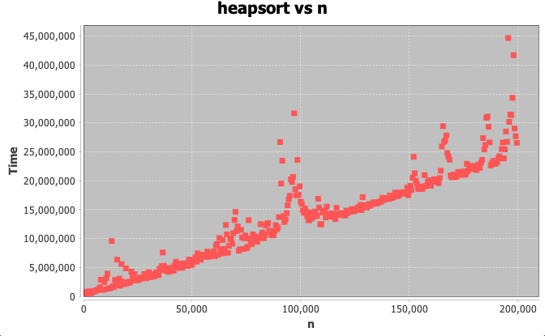

# Relative time complexities of sorting algorithms
This java project analyzes the quicksort, heapsort, and radixsort algorithms and their time complexities. Each sorting algorithm is implemented as a static method in the Main class. 

## Graphs
For each graph, the x axis n is the size of the random array to be sorted, and the y axis Time is in nanoseconds

