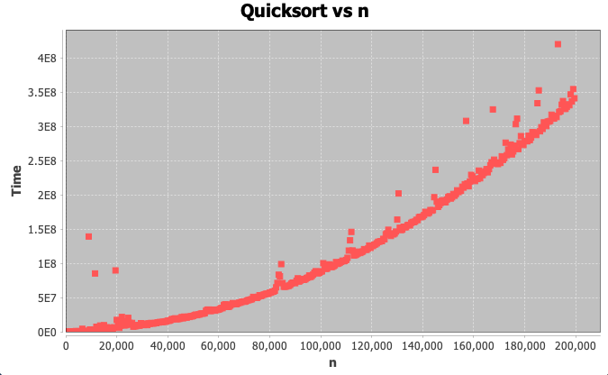
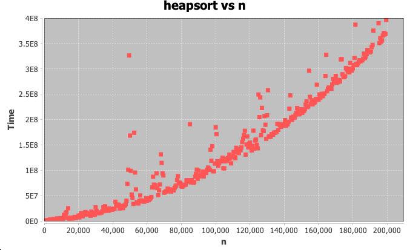
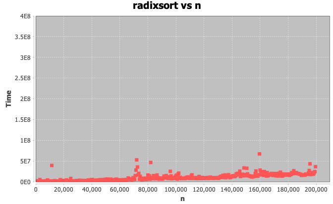

# Relative time complexities of sorting algorithms
This java project analyzes the quicksort, heapsort, and radixsort algorithms and their time complexities. Each sorting algorithm is implemented as a static method in the Main class. 

## Graphs
For each graph, the x axis n is the size of the random array to be sorted, and the y axis Time is the amount of time the sorting algorithm takes to sort that array in ascending order, in nanoseconds

## Analysis
Quicksort and heapsort are slower than radixsort for large n. This makes sense, as quicksort and heapsort have average time complexities of O(nlog(n)), whereas radixsort's is O(nbd), where b = number system base, and d = max digits of each array item. Since we are using base 10, and this implementation limits the max array item digits to 5, radixsort is more efficient than the others for large n. 